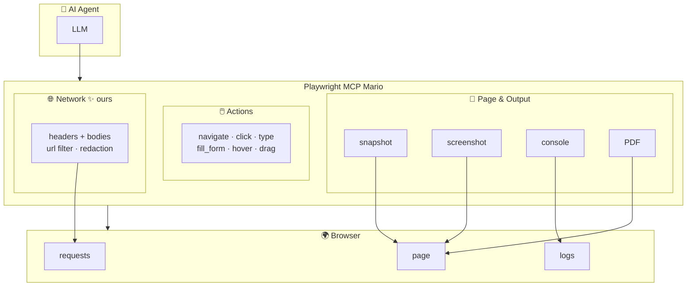

# Playwright MCP Mario

[](https://github.com/mariocosttaa/mario-playwright-mcp/releases)
[](https://nodejs.org/)
[](https://playwright.dev/)
[](LICENSE)

**Browser MCP for AI agents** — based on [Microsoft Playwright MCP](https://github.com/microsoft/playwright-mcp) with extensions for **network payload capture** and QA workflows.

---

## What is this?

An MCP server that lets LLMs control a browser through accessibility snapshots (no vision models needed). This fork adds **network payload capture** and **sensitive redaction** — better for API debugging and QA.



**Inside the browser** — The MCP reads page content (accessibility snapshot, screenshots), console messages, and network traffic. It can navigate, click, type, fill forms, and more.

**Mario vs upstream** — Upstream `browser_network_requests` returns only `[POST] url => [200]`. Mario adds `includePayloads` (headers + bodies), `url` filter to drill into specific endpoints, and auto-redacts `password`, `token`, `cookie`, etc.

---

## Quick start

### 1. Clone and install

```bash
git clone https://github.com/YOUR_ORG/mario-playwright-mcp.git
cd mario-playwright-mcp
npm install
npx playwright install chromium
```

### 2. Configure your MCP client

**Cursor** (in `~/.cursor/mcp.json` or Settings → MCP):

```json
{
  "mcpServers": {
    "playwright-mcp": {
      "command": "node",
      "args": [
        "/path/to/mario-playwright-mcp/packages/playwright-mcp/cli.js",
        "--output-dir",
        ".mcp-output"
      ]
    }
  }
}
```

Output (console logs, screenshots, etc.) goes to `.mcp-output/` in the workspace. Add `.mcp-output/` to `.gitignore` to keep the repo clean.

**Generic config** (VS Code, Claude Desktop, etc.) — use `node` + path to `cli.js` as above.

### 3. Use it

Open a project, start a chat, and use tools like `browser_navigate`, `browser_snapshot`, `browser_network_requests`.

---

## Tools

All tools the Playwright MCP exposes. ✨ = **Mario-enhanced** (better in this fork).

### Core (always available)

| Tool | Description |
|------|-------------|
| `browser_navigate` | Navigate to a URL |
| `browser_navigate_back` | Go back |
| `browser_snapshot` | Capture accessibility tree (better than screenshot for actions) |
| `browser_take_screenshot` | Take a screenshot |
| `browser_console_messages` | Get console logs |
| `browser_network_requests` ✨ | List network requests — **Mario:** adds `includePayloads`, `url` filter, `maxBodySize`, sensitive redaction |
| `browser_click` | Click an element |
| `browser_type` | Type text into an element |
| `browser_hover` | Hover over an element |
| `browser_drag` | Drag and drop |
| `browser_fill_form` | Fill multiple form fields |
| `browser_select_option` | Select dropdown option |
| `browser_press_key` | Press a key |
| `browser_resize` | Resize window |
| `browser_evaluate` | Run JavaScript on the page |
| `browser_run_code` | Run Playwright code snippet |
| `browser_file_upload` | Upload files |
| `browser_handle_dialog` | Accept/dismiss dialogs |
| `browser_wait_for` | Wait for text or time |
| `browser_tabs` | List, create, close, or switch tabs |
| `browser_close` | Close the browser |
| `browser_install` | Install the browser (if missing) |

### Opt-in (pass `--caps=…`)

| Capability | Tools |
|------------|-------|
| `--caps=pdf` | `browser_pdf_save` — Save page as PDF |
| `--caps=vision` | `browser_mouse_move_xy`, `browser_mouse_click_xy`, `browser_mouse_drag_xy`, `browser_mouse_down`, `browser_mouse_up`, `browser_mouse_wheel` — Coordinate-based actions |
| `--caps=testing` | `browser_generate_locator`, `browser_verify_element_visible`, `browser_verify_list_visible`, `browser_verify_text_visible`, `browser_verify_value` — Test assertions |

---

## Extensions (vs upstream)

### Network payload capture

`browser_network_requests` supports:

| Param | Description |
|-------|-------------|
| `includePayloads` | When `true`, include request/response headers and bodies |
| `url` | Filter by URL substring (e.g. `/login`, `/api/users`) |
| `maxBodySize` | Max response body size (default 50KB) |
| `includeStatic` | Include images, fonts, etc. (default `false`) |

**Example** — get full details for a login call:

```
browser_network_requests(url: "/login", includePayloads: true)
```

Output:

```
[POST] https://api.example.com/login => [200] OK
  Request headers: { "content-type": "application/json", ... }
  Request body: {"email":"user@example.com","password":"***"}
  Response headers: { "content-type": "application/json", ... }
  Response body: {"token":"***","user":{...}}
```

Sensitive keys (`password`, `token`, `secret`, `authorization`, `cookie`, `api_key`) are redacted as `***`.

### Workflow

1. `browser_network_requests(includeStatic: false)` → list URLs
2. `browser_network_requests(url: "/api/endpoint", includePayloads: true)` → headers + bodies for that request

---

## Project structure

```
mario-playwright-mcp/
├── packages/
│   ├── playwright-mcp/     # MCP server
│   └── extension/          # Browser extension (upstream)
├── patches/                # Network payload patch for Playwright
├── docs/                   # Extra docs
│   └── UPSTREAM.md         # Update from Microsoft upstream
└── README.md
```

---

## Update from upstream

```bash
git remote add upstream https://github.com/microsoft/playwright-mcp.git
git fetch upstream
git merge upstream/main
npm install
```

If Playwright version changes and the patch fails, re-apply changes in `node_modules/playwright/lib/mcp/browser/tools/network.js` and run `npx patch-package playwright`. See [docs/UPSTREAM.md](docs/UPSTREAM.md).

---

## Requirements

- Node.js 18+
- MCP client (Cursor, VS Code, Claude Desktop, Goose, etc.)

For client-specific configs (Amp, Cline, LM Studio, etc.) and CLI options, see the [upstream README](https://github.com/microsoft/playwright-mcp).

---

## Versioning

- **main** — development branch
- **1.1** — first Mario fork release (network payload capture, .mcp-output, etc.)
- **1.2, 1.3, …** — future releases as changes land

Use semantic versioning: patch for fixes (1.1.1), minor for features (1.2.0).

---

## License

Apache 2.0 — see [LICENSE](LICENSE). Based on [Microsoft Playwright MCP](https://github.com/microsoft/playwright-mcp).
